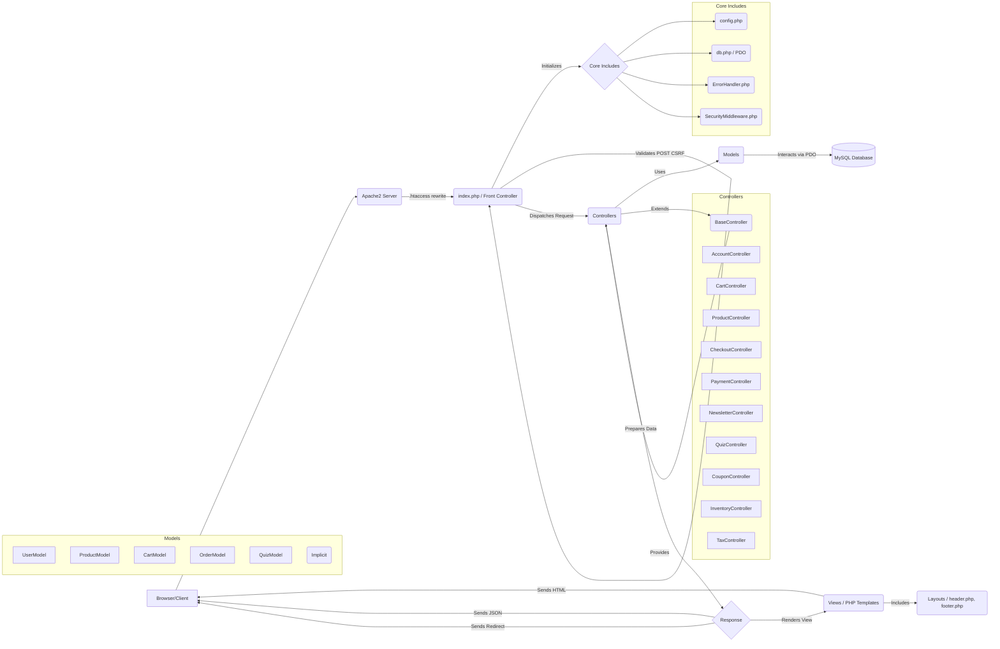

# The Scent – Technical Design Specification (v14.0)

## Table of Contents

1.  [Introduction](#introduction)
2.  [Project Philosophy & Goals](#project-philosophy--goals)
3.  [System Architecture Overview](#system-architecture-overview)
    *   3.1 [High-Level Workflow](#high-level-workflow)
    *   3.2 [Request-Response Life Cycle (Implemented Confirmation Flow)](#request-response-life-cycle-implemented-confirmation-flow)
4.  [Directory & File Structure](#directory--file-structure)
    *   4.1 [Folder Map](#folder-map)
    *   4.2 [Key Files Explained](#key-files-explained)
5.  [Routing and Application Flow](#routing-and-application-flow)
    *   5.1 [URL Routing via .htaccess](#url-routing-via-htaccess)
    *   5.2 [index.php: The Application Entry Point](#indexphp-the-application-entry-point)
    *   5.3 [Controller Dispatch & Action Flow](#controller-dispatch--action-flow)
    *   5.4 [Views: Templating and Rendering](#views-templating-and-rendering)
6.  [Frontend Architecture](#frontend-architecture)
    *   6.1 [CSS (css/style.css), Tailwind (CDN), and Other Libraries](#css-cssstylecss-tailwind-cdn-and-other-libraries)
    *   6.2 [Responsive Design and Accessibility](#responsive-design-and-accessibility)
    *   6.3 [JavaScript: Interactivity, Libraries, and CSRF Handling](#javascript-interactivity-libraries-and-csrf-handling)
7.  [Key Pages & Components](#key-pages--components)
    *   7.1 [Home/Landing Page (views/home.php)](#homelanding-page-viewshomephp)
    *   7.2 [Header and Navigation (views/layout/header.php)](#header-and-navigation-viewslayoutheaderphp)
    *   7.3 [Footer and Newsletter (views/layout/footer.php)](#footer-and-newsletter-viewslayoutfooterphp)
    *   7.4 [Product Grid & Cards](#product-grid--cards)
    *   7.5 [Shopping Cart (views/cart.php)](#shopping-cart-viewscartphp)
    *   7.6 [Product Detail Page (views/product_detail.php)](#product-detail-page-viewsproduct_detailphp)
    *   7.7 [Products Page (views/products.php)](#products-page-viewsproductsphp)
    *   7.8 [Checkout Process (views/checkout.php)](#checkout-process-viewscheckoutphp)
    *   7.9 [Order Confirmation (views/order_confirmation.php)](#order-confirmation-viewsorder_confirmationphp)
    *   7.10 [User Account Pages (views/account/*)](#user-account-pages-viewsaccount)
    *   7.11 [Quiz Flow & Personalization](#quiz-flow--personalization)
8.  [Backend Logic & Core PHP Components](#backend-logic--core-php-components)
    *   8.1 [Includes: Shared Logic (includes/)](#includes-shared-logic-includes)
    *   8.2 [Controllers: Business Logic Layer (controllers/ & BaseController.php)](#controllers-business-logic-layer-controllers--basecontrollerphp)
    *   8.3 [Database Abstraction (includes/db.php & models/)](#database-abstraction-includesdbphp--models)
    *   8.4 [Security Middleware & Error Handling](#security-middleware--error-handling)
    *   8.5 [Session, Auth, and User Flow](#session-auth-and-user-flow)
    *   8.6 [Payment Processing & Webhook Handling](#payment-processing--webhook-handling)
9.  [Database Design](#database-design)
    *   9.1 [Entity-Relationship Model (Conceptual)](#entity-relationship-model-conceptual)
    *   9.2 [Core Tables (from schema.sql + Updates)](#core-tables-from-schemasql--updates)
    *   9.3 [Schema Considerations & Recommendations](#schema-considerations--recommendations)
    *   9.4 [Data Flow Examples (Current State)](#data-flow-examples-current-state)
10. [Security Considerations & Best Practices](#security-considerations--best-practices)
    *   10.1 [Input Sanitization & Validation](#input-sanitization--validation)
    *   10.2 [Session Management](#session-management)
    *   10.3 [CSRF Protection (Implemented - Strict Pattern Required)](#csrf-protection-implemented---strict-pattern-required)
    *   10.4 [Security Headers & CSP Standardization](#security-headers--csp-standardization)
    *   10.5 [Rate Limiting (Standardization Recommended)](#rate-limiting-standardization-recommended)
    *   10.6 [File Uploads & Permissions](#file-uploads--permissions)
    *   10.7 [Audit Logging & Error Handling](#audit-logging--error-handling)
    *   10.8 [SQL Injection Prevention](#sql-injection-prevention)
    *   10.9 [Payment Security](#payment-security)
11. [Extensibility & Onboarding](#extensibility--onboarding)
    *   11.1 [Adding Features, Pages, or Controllers](#adding-features-pages-or-controllers)
    *   11.2 [Adding Products, Categories, and Quiz Questions](#adding-products-categories-and-quiz-questions)
    *   11.3 [Developer Onboarding Checklist](#developer-onboarding-checklist)
    *   11.4 [Testing & Debugging Notes](#testing--debugging-notes)
12. [Future Enhancements & Recommendations](#future-enhancements--recommendations)
13. [Appendices](#appendices)
    *   A. [Key File Summaries](#a-key-file-summaries)
    *   B. [Glossary](#b-glossary)
    *   C. [Code Snippets and Patterns (CSRF, Implemented Confirmation Flow)](#c-code-snippets-and-patterns-csrf-implemented-confirmation-flow)

---

## 1. Introduction

The Scent is a modular, secure, and extensible e-commerce platform focused on delivering premium aromatherapy products. It’s engineered with a custom PHP MVC-inspired architecture without reliance on heavy frameworks, maximizing transparency and developer control. This document (**v14.0**) serves as the updated technical design specification, reflecting the project's current state after incorporating the latest code reviews, fixes, and analysis.

This version documents **significant improvements and clarifications**:

1.  **Resolved Checkout Page Load Error:** The fatal error preventing `views/checkout.php` from loading has been fixed by implementing the `getAddress()` method in `models/User.php` and applying the required database schema patch (`db/the_scent_update_users_table.sql`). **The checkout page now loads correctly after user login.**
2.  **Robust Order Confirmation Flow:** The critically flawed session-based order confirmation logic in `CheckoutController::showOrderConfirmation` has been **completely replaced**. The new implementation correctly uses the `payment_intent` ID from the Stripe redirect URL, verifies the payment status directly with the Stripe API, validates order ownership, and fetches complete order details before rendering the confirmation view (`views/order_confirmation.php`). **This flow is now reliable.**
3.  **Account Views UI Fixed:** The broken layout on account pages (`/index.php?page=account*`) has been resolved by adding standard header/footer includes (`views/layout/header.php`, `views/layout/footer.php`) to all account view files (`views/account/*.php`).
4.  **Quiz Flow CSRF Fixed:** The CSRF error on quiz submission has been resolved by updating `QuizController::showQuiz()` to correctly fetch and pass the CSRF token to the `views/quiz.php` view.
5.  **Product Filter Error Fixed:** The `TypeError` occurring when filtering products by category has been resolved by correcting the `logSecurityEvent` call in `ProductController.php`.
6.  **Functional User Management & Core Flows:** User Registration, Login (AJAX), Profile Update (Name, Email, Password, Newsletter), Password Reset, Add-to-Cart (AJAX), Cart Management (AJAX), Product Listing/Filtering/Pagination, and the Scent Quiz are confirmed functional.

**Remaining Known Issues / Areas for Improvement:**

*   **Cart Storage Inconsistency:** The system uses Session storage for guest carts and Database storage (`cart_items` table) for logged-in users. This needs standardization for better reliability and user experience.
*   **Rate Limiting Inconsistency:** The rate limiting mechanism exists in `BaseController` but is not applied consistently across all relevant sensitive endpoints (e.g., profile updates, checkout submission).
*   **Address Saving:** While `User::getAddress()` fetches addresses, the logic to *save* addresses during profile updates or checkout is not yet implemented.
*   **Error Handling:** The "Headers Already Sent" warning noted in `ErrorHandler.php` suggests potential issues if errors occur late in the request lifecycle.

This document provides a comprehensive overview of the current architecture, logic, and flow, serving as an onboarding guide and reference for ongoing development.

---

## 2. Project Philosophy & Goals

*   **Security First:** Implemented via PDO Prepared Statements, input validation (`SecurityMiddleware`), secure session handling, CSRF protection (Synchronizer Token Pattern, enforced globally on POST), and security headers (CSP needs review). **Rate limiting requires consistent implementation.**
*   **Simplicity & Maintainability:** Modular structure, clear includes in `index.php`. Consistent coding patterns enforced, especially for CSRF.
*   **Extensibility:** Architecture allows adding new features/pages, requiring manual includes but providing clear extension points. New POST features must follow the CSRF pattern.
*   **Performance:** Direct routing, PDO prepared statements. CDN for frontend libs. Caching (APCu for rate limiting) used but needs standardization.
*   **Modern User Experience:** Responsive design (Tailwind), subtle animations (AOS, Particles), AJAX interactions (Cart, Newsletter, Login/Register). **Core user flows (Auth, Cart, Checkout Load, Order Confirmation, Quiz) are now functional.** **Account UI fixed.**
*   **Transparency:** Explicit routing and includes in `index.php`.
*   **Accessibility & SEO:** Semantic HTML, `aria-label` usage. Basic practices followed.

---

## 3. System Architecture Overview

### 3.1 High-Level Workflow



*   **Key Principles:** Centralized routing (`index.php`), separation of concerns (Controller logic, Model data access, View presentation), secure database interaction (PDO Prepared Statements), global CSRF validation on POST. `BaseController` provides shared utilities.

### 3.2 Request-Response Life Cycle (Implemented Confirmation Flow)

*(Example: User completes payment and is redirected back)*

1.  **Redirect from Stripe:** User lands on `index.php?page=checkout&action=confirmation&payment_intent=pi_...&payment_intent_client_secret=cs_...` (Actual URL structure may vary slightly based on Stripe settings).
2.  **Initialization (`/index.php`):** Core files loaded (`db.php`, `SecurityMiddleware`, `ErrorHandler`, etc.), DB connected, security middleware applied. Session started.
3.  **Routing (`/index.php`):** `$page='checkout'`, `$action='confirmation'`. CSRF check skipped (GET request). Routes to `CheckoutController::showOrderConfirmation()`.
4.  **Controller Action (`CheckoutController::showOrderConfirmation` - Implemented Logic):**
    *   `$this->requireLogin()`: Verifies user session is active and valid.
    *   Extracts `payment_intent` ID (`$paymentIntentId`) from `$_GET`. Validates it using `$this->validateInput()`. Redirects if invalid.
    *   Retrieves the `StripeClient` instance via `$this->paymentController->getStripeClient()`. Handles potential errors if client is unavailable.
    *   **Calls Stripe API:** `$paymentIntent = $stripeClient->paymentIntents->retrieve($paymentIntentId, []);`. Catches `\Stripe\Exception\ApiErrorException`.
    *   **Verifies PI Status:** Checks `$paymentIntent->status === 'succeeded'`. Redirects with flash message if not succeeded (e.g., pending, failed).
    *   **Fetches Order from DB:** `$order = $this->orderModel->getByPaymentIntentId($paymentIntentId);`.
    *   **Validates Order & Ownership:** Checks if `$order` exists and if `$order['user_id']` matches the currently logged-in user's ID (`$this->getUserId()`). Logs security event and redirects if mismatch.
    *   **Fetches Full Order Details:** Calls `$fullOrder = $this->orderModel->getByIdAndUserId($order['id'], $userId);` to get order details including items. Redirects if fetching fails.
    *   **Renders View:** Calls `$this->renderView('order_confirmation', ['order' => $fullOrder, ...]);` passing the verified order data.
5.  **View Rendering (`views/order_confirmation.php`):** Displays order details received from the controller.
6.  **Response Transmission:** Server sends the rendered HTML confirmation page to the browser.

---

## 4. Directory & File Structure

### 4.1 Folder Map

```
/ (project root: /cdrom/project/The-Scent-oa5) <-- Apache DocumentRoot
|-- index.php              # Main entry script (routing, core includes, dispatch, POST CSRF validation)
|-- config.php             # Environment, DB, security settings (SECURITY_SETTINGS array)
|-- css/
|   |-- style.css          # Custom CSS rules (Merged from provided files)
|   |-- admin.css          # Minimal admin CSS (Relies on Tailwind)
|-- images/                # Public image assets (structure assumed, contains products/)
|-- videos/                # Public video assets (e.g., hero.mp4)
|-- particles.json         # Particles.js configuration
|-- .htaccess              # Apache URL rewrite rules & config
|-- includes/              # Shared PHP utility/core files
|   |-- auth.php           # Helpers: isLoggedIn(), isAdmin() (partially redundant with BaseController)
|   |-- db.php             # PDO connection setup (makes $pdo available)
|   |-- SecurityMiddleware.php # Security helpers (apply headers/session, validation, CSRF gen/validation)
|   |-- ErrorHandler.php   # Error/exception handling setup (Headers issue noted)
|   |-- EmailService.php   # Email sending logic
|-- controllers/           # Business logic / request handlers
|   |-- BaseController.php # Abstract base with shared helpers (DB, JSON, redirect, validation, CSRF token fetch, Rate Limiting, auth checks, logging, etc.)
|   |-- AccountController.php # User auth, profile (Functional)
|   |-- ProductController.php # Product listing/detail (Pagination OK, Logging fixed)
|   |-- CartController.php    # Cart logic, AJAX handlers (Storage inconsistency noted)
|   |-- CheckoutController.php # Checkout process (Loads OK, Confirmation OK)
|   |-- PaymentController.php # Payment Intent creation, Webhook handling (Webhook OK)
|   |-- NewsletterController.php # Newsletter subscription
|   |-- QuizController.php    # Quiz logic (CSRF passing fixed)
|   |-- CouponController.php  # Coupon admin logic
|   |-- InventoryController.php# Stock management logic
|   |-- TaxController.php     # Tax calculation logic
|-- models/                # Data representation / DB interaction (using PDO Prepared Statements)
|   |-- Product.php        # Product data access (Pagination OK)
|   |-- User.php           # User data access (Updated & Functional, getAddress implemented)
|   |-- Order.php          # Order data access (Compatible)
|   |-- Cart.php           # DB Cart logic (Usage inconsistent)
|   |-- Quiz.php           # Quiz data access (Updated with missing methods)
|-- views/                 # HTML/PHP templates
|   |-- home.php, products.php, product_detail.php, cart.php, checkout.php, ... # Page views
|   |-- account/             # User account specific views (UI Fixed - Includes added)
|   |   |-- dashboard.php
|   |   |-- order_details.php
|   |   |-- orders.php
|   |   |-- profile.php
|   |   |-- (quiz_history.php - if implemented)
|   |-- admin/             # Admin-specific views (Coupons, Quiz Analytics functional)
|   |   |-- coupons.php, quiz_analytics.php, products.php, product_form.php, dashboard.php, ...
|   |-- layout/            # Reusable layout partials (header, footer, admin_header, admin_footer)
|   |   |-- header.php
|   |   |-- footer.php
|   |   |-- admin_header.php
|   |   |-- admin_footer.php
|   |-- order_confirmation.php # View for confirmation page (Functional)
|   |-- checkout.php         # View for checkout (Loads OK, defensive coding added)
|   |-- quiz.php             # View for quiz form (CSRF OK)
|   |-- quiz_results.php     # View for quiz results display
|   |-- ... (other static/error views: 404.php, error.php, contact.php, etc.)
|-- logs/                  # Directory for log files (requires write permissions)
|   |-- security.log
|   |-- error.log
|   |-- audit.log
|-- db/                    # Database schema & patches
|   |-- the_scent_schema.sql.txt # Base schema definition
|   |-- the_scent_update_users_table.sql # REQUIRED patch for 'users' table
|-- js/                    # Custom JavaScript
|   |-- main.js            # Global handlers (AJAX, UI), page initializers (CSRF OK)
|-- README.md              # Project documentation (Should be updated based on this TDS)
|-- technical_design_specification.md # (This document v14.0)
|-- composer.json, composer.lock, vendor/ # (Recommended) Added if Composer is used
|-- LICENSE                # MIT License file (Assumed)
|-- ... (other docs, HTML output files)
```

### 4.2 Key Files Explained

*   **index.php**: Central router. **Auto POST CSRF validation robust.** Dispatches correctly. **Correctly handles `CheckoutController` dependency injection.**
*   **config.php**: Central config. **CSP needs review.** Rate limit config exists but usage inconsistent. Secrets exposure risk.
*   **includes/SecurityMiddleware.php**: Provides core security functions. OK.
*   **controllers/BaseController.php**: Abstract base. Provides essential helpers. Rate limiting usage inconsistent. OK.
*   **controllers/AccountController.php**: Handles user auth/profile. **Functional.**
*   **controllers/CheckoutController.php**: Handles checkout. **Loads OK.** **`showOrderConfirmation` logic fixed and robust.**
*   **controllers/PaymentController.php**: Stripe PI creation, Webhook handling. **Webhook session dependency removed.** `getStripeClient()` available. OK.
*   **controllers/CartController.php**: Handles cart logic via AJAX. Functional. **Cart storage inconsistency noted.**
*   **controllers/ProductController.php**: Product listing/detail/admin. Pagination OK. **Logging TypeError fixed.** OK.
*   **controllers/QuizController.php**: Quiz logic. **CSRF token passing fixed.** Relies on `QuizModel` methods. OK.
*   **models/User.php**: **Updated & Functional.** `getAddress` implemented. Meets `AccountController` needs. Requires schema patch applied.
*   **models/Order.php**: Order DB logic. Compatible. OK.
*   **models/Product.php**: Product DB logic. Pagination functional. OK.
*   **models/Cart.php**: DB cart logic. Usage inconsistent. OK.
*   **models/Quiz.php**: Quiz DB logic. **Updated with missing methods.** OK.
*   **views/layout/header.php**: Outputs global CSRF token (`#csrf-token-value`). Reflects login state. OK.
*   **views/layout/footer.php**: Includes `main.js`. OK.
*   **views/account/*.php**: Account section views. **Layout fixed by adding header/footer includes.** Compatible with CSS/JS. OK.
*   **views/checkout.php**: **Loads correctly.** Uses `$userAddress`. AJAX/Stripe JS functional. Defensive coding added. OK.
*   **views/order_confirmation.php**: View OK. **Controller logic fixed.** OK.
*   **views/quiz.php**: View OK. **Controller now passes CSRF token.** OK.
*   **js/main.js**: Handles AJAX. **Correctly reads/sends CSRF token.** Page initializers OK.
*   **includes/ErrorHandler.php**: Global error handling. **"Headers Already Sent" issue noted.**
*   **db/the_scent_update_users_table.sql**: **Mandatory patch script** for database schema.

---

## 5. Routing and Application Flow

*(No fundamental changes needed, emphasis on CSRF & Controller Instantiation)*

### 5.1 URL Routing via .htaccess

*   Standard `mod_rewrite` rules route non-file/directory requests to `/index.php`. Verified functional.

### 5.2 index.php: The Application Entry Point

*   Single entry point. Initializes core systems. Determines `$page`, `$action`. **Crucially, validates CSRF token globally for all POST requests before routing (except Stripe webhook).** Dispatches based on `$page`. **Correctly handles `CheckoutController` dependency injection.**

### 5.3 Controller Dispatch & Action Flow

*   Controllers included/instantiated within `index.php` switch. Extend `BaseController`.
*   **CSRF Token Flow:** Controllers rendering views needing subsequent CSRF protection *must* fetch the token (`$this->getCsrfToken()`) and pass it to the view data array. **(Confirmed fixed for QuizController)**.
*   Controllers handling AJAX POST expect CSRF token in the request body (validated by `index.php`). Controllers handling standard POST expect CSRF token in `$_POST['csrf_token']` (validated by `index.php`).
*   Rate limiting check (`$this->validateRateLimit()`) **should be applied** consistently in sensitive controller actions. **(Still inconsistent)**.

### 5.4 Views: Templating and Rendering

*   PHP files in `views/` mix HTML and PHP. Use `htmlspecialchars()` for output.
*   **CSRF Token Output:** Views initiating forms/AJAX **must** output the token via `<input type="hidden" id="csrf-token-value" value="...">`. Standard forms *also* need `<input type="hidden" name="csrf_token" value="...">`. **(Confirmed correct in relevant views)**.
*   JS reads token from `#csrf-token-value`.

---

## 6. Frontend Architecture

*(CSRF handling confirmed correct)*

### 6.1 CSS (css/style.css), Tailwind (CDN), and Other Libraries

*   Styling via Tailwind CDN + custom CSS.
*   Libraries: Google Fonts, Font Awesome 6, AOS.js, Particles.js (CDNs/local).
*   Mobile Nav CSS fixed.
*   **Account views now correctly include CSS/JS via header/footer.**

### 6.2 Responsive Design and Accessibility

*   Tailwind for responsiveness. Mobile menu functional. Basic accessibility considered.

### 6.3 JavaScript: Interactivity, Libraries, and CSRF Handling

*   **`js/main.js`:** Core script included in footer. Handles global UI (flash messages, mobile menu) and AJAX interactions.
*   **Page Initializers:** Use `body` class to trigger specific JS setup (e.g., `initCartPage`, `initCheckoutPage`, `initLoginPage`, `initRegisterPage`). **Account pages now load JS correctly.**
*   **AJAX CSRF:** All AJAX POST requests (Add-to-Cart, Cart Update/Remove, Login, Register, Newsletter, Checkout Coupon/Tax) correctly read the CSRF token from the global `#csrf-token-value` hidden input and include it in the request body/payload. This aligns with the server-side validation in `index.php`. **Correct.**

---

## 7. Key Pages & Components

*   **Home/Landing Page:** Functional.
*   **Header/Navigation:** Functional. CSRF output OK.
*   **Footer/Newsletter:** Functional.
*   **Product Grid/Cards:** Functional.
*   **Shopping Cart:** Functional with updated UI. AJAX OK. **Cart storage inconsistency noted.**
*   **Product Detail Page:** Functional.
*   **Products Page:** Functional. Filters/Sorting/Pagination work. **Category filter error fixed.**
*   **Checkout Process:** **Loads correctly.** Address pre-filling works (if data exists). AJAX OK. Payment Intent creation OK.
*   **Order Confirmation:** **Functional & Reliable.** Controller logic now robustly verifies payment via Stripe API.
*   **User Account Pages:** **UI Fixed & Functional** (Dashboard, Orders List/Details, Profile View/Update).
*   **Quiz Flow:** **Functional.** CSRF issue fixed in Controller/View interaction.

---

## 8. Backend Logic & Core PHP Components

*   **Includes:** Core utilities function as expected. `auth.php` partially redundant.
*   **Controllers:** Logic separated. `BaseController` provides shared functionality.
    *   `AccountController`: Functional.
    *   `CheckoutController`: **Loads & Confirmation Flow Fixed.**
    *   `PaymentController`: PI creation OK. **Webhook session dependency removed.** `getStripeClient()` available.
    *   `CartController`: Functional AJAX. **Cart storage inconsistency.**
    *   `ProductController`: **Logging TypeError fixed.** Admin routing clarified.
    *   `QuizController`: **CSRF token passing fixed.**
    *   Rate limiting usage inconsistent.
*   **Database Abstraction:** PDO Prepared Statements used throughout Models. **Secure.**
*   **Models:**
    *   `User.php`: **Updated & Functional.** `getAddress` implemented.
    *   `Order.php`: Compatible. OK.
    *   `Product.php`: Pagination functional. OK.
    *   `Cart.php`: Usage inconsistent. OK.
    *   `Quiz.php`: **Updated with missing methods.** OK.
*   **Security Middleware & Error Handling:** `SecurityMiddleware` enforces headers, session rules, CSRF. `ErrorHandler` handles errors globally, but "Headers Already Sent" issue exists.
*   **Session, Auth, User Flow:** Secure session handling implemented. Auth flows functional.
*   **Payment Processing & Webhook:** Stripe PI flow implemented. **Webhook confirmation flow dependency removed.** Signature verification OK.

---

## 9. Database Design

### 9.1 Entity-Relationship Model (Conceptual)

*(No changes needed)*

Standard e-commerce relationships.

### 9.2 Core Tables (from schema.sql + Updates)

*   Schema defined in `the_scent_schema.sql.txt`.
*   **Mandatory Update:** `the_scent_update_users_table.sql` must be applied to add necessary columns to the `users` table (status, newsletter, reset tokens, timestamps, address fields).

### 9.3 Schema Considerations & Recommendations

*   **Addresses:** Currently in `users` table. Functional, but separate table recommended for scalability.
*   **Cart:** `cart_items` table exists but inconsistently used vs. Session. **Recommendation:** Standardize usage.

### 9.4 Data Flow Examples (Current State)

*   **Add to Cart:** Works via AJAX, updates session/DB depending on login.
*   **Checkout Page Load:** Works. Fetches cart, user address, renders form.
*   **Checkout Submit:** Works. Server validates, creates order/PI, returns clientSecret.
*   **Payment Success -> Redirect:** Works. Stripe redirects to confirmation URL with `payment_intent` parameter.
*   **Confirmation Page Load:** **Works.** `CheckoutController` uses `payment_intent` ID to verify via Stripe API, checks ownership, fetches order, renders view.
*   **Quiz Submit:** **Works.** `QuizController` validates CSRF, gets recommendations, saves result (if logged in), redirects to results page.

---

## 10. Security Considerations & Best Practices

*   **Input Sanitization & Validation:** **Implemented** via `SecurityMiddleware`.
*   **Session Management:** **Implemented** (Secure flags, regeneration, integrity checks).
*   **CSRF Protection:** **Implemented & Fixed** (Synchronizer Token Pattern, global POST validation). Correct JS handling.
*   **Security Headers & CSP:** **Implemented.** CSP needs review/tightening.
*   **Rate Limiting:** **Partially Implemented.** Mechanism exists (`BaseController`), but usage needs standardization. Relies on APCu.
*   **File Uploads & Permissions:** Validation logic exists. Secure handling needed if used. `logs/` needs correct permissions.
*   **Audit Logging & Error Handling:** **Implemented.** Error handling has "Headers Already Sent" issue. Logging TypeErrors fixed.
*   **SQL Injection Prevention:** **Implemented** via PDO Prepared Statements.
*   **Payment Security:** Handled via Stripe Elements (PCI compliance offloaded). Webhook signature verification **implemented**.

---

## 11. Extensibility & Onboarding

### 11.1 Adding Features, Pages, or Controllers

*   Follow pattern: Controller -> View -> `index.php` route. Implement CSRF token pattern for POST. Extend `BaseController`.

### 11.2 Adding Products, Categories, and Quiz Questions

*   Via DB or future Admin UI.

### 11.3 Developer Onboarding Checklist

1.  Setup LAMP/LEMP, enable `mod_rewrite`.
2.  Clone repo.
3.  Setup DB, import *base* schema (`the_scent_schema.sql.txt`).
4.  **Apply DB schema updates:** Execute `the_scent_update_users_table.sql`.
5.  Configure `config.php`.
6.  Set file permissions (`logs/` writable).
7.  Configure Apache VirtualHost.
8.  **(Optional but Recommended):** If using Composer dependencies (PHPMailer, Stripe SDK), run `composer install`.
9.  Browse site, check logs (`error.log`, `security.log`).
10. **Verify CSRF flow** (inspect views/JS, test POST actions like Quiz submit, Login, Register).
11. **Verify Core Functionality:** Add-to-Cart, Cart View/Update, Product List/Pagination/Filtering, Login/Register, Profile Update, Password Reset, Quiz Flow. Verify Checkout page loads. **Verify successful payment leads to the Order Confirmation page.** **Verify Account Dashboard UI.**
12. **Note Known Issues:** Understand cart inconsistency and rate limiting gaps.

### 11.4 Testing & Debugging Notes

*   Use browser dev tools, application logs (`logs/`), server logs (`apache_logs/`).
*   Test Checkout page load.
*   Test User Profile/Password flows.
*   **Test the full payment flow through to the Order Confirmation page.**
*   Test cart behavior when logging in/out.
*   Test Quiz submission and results page.
*   Test Product category filtering.
*   Test Account Dashboard UI.
*   Manually trigger rate limits if testing that feature.
*   Enable `ENVIRONMENT = 'development'` in `config.php` for detailed PHP errors during debugging (disable for production).

---

## 12. Future Enhancements & Recommendations

*(Prioritized List - Core issues addressed)*

1.  **Standardize Cart Storage (High Priority):** Choose DB-only (for logged-in) or Session-only (until checkout) and enforce consistently in `CartController`. DB-only is generally preferred for logged-in persistence.
2.  **Standardize Rate Limiting (Medium Priority):** Apply `BaseController::validateRateLimit()` consistently to sensitive controller actions (Login, Register, Password Reset, Checkout Submit, Coupon Apply, Profile Update). Ensure APCu reliability or implement fallback.
3.  **Review & Tighten Content Security Policy (Medium Priority):** Update CSP in `config.php` based on actual needs (Stripe, fonts, etc.). Avoid `'unsafe-inline'` if possible.
4.  **Fix Error Handling ("Headers Already Sent") (Medium Priority):** Make `views/error.php` self-contained or use output buffering more consistently in `ErrorHandler`.
5.  **Implement Address Saving (Medium Priority):** Add logic to save user addresses (profile/checkout). Update `views/checkout.php` to use this stored data if available.
6.  **Code Quality & Refactoring (Ongoing/Future):**
    *   Implement Composer for autoloading and managing dependencies (PHPMailer, Stripe SDK).
    *   Refactor `index.php` routing to a dedicated Router class.
    *   Consider a simple templating engine (e.g., Twig, Plates) for cleaner views.
    *   Use `.env` files for configuration/secrets.
    *   Implement database migrations.
    *   Add unit/integration tests.
7.  **Full Admin Panel (Future):** Develop CRUD interfaces for Products, Orders, Users, etc. Improve Quiz Analytics methods in `QuizModel`.
8.  **Advanced Features (Future):** Search improvements, user reviews, wishlists, etc.

---

## 13. Appendices

### A. Key File Summaries

| File/Folder                 | Purpose                                                        | Status Notes                                                                     |
| :-------------------------- | :------------------------------------------------------------- | :------------------------------------------------------------------------------- |
| `index.php`                 | Entry point, routing, core includes, auto POST CSRF validation | OK. Correct DI for CheckoutController.                                           |
| `config.php`                | DB credentials, App/Security settings, API keys              | OK. CSP/Rate Limit review needed. Secrets exposure.                            |
| `includes/SecurityMiddleware.php` | Static security helpers (validation, CSRF)                   | OK.                                                                              |
| `controllers/BaseController.php` | Abstract base helpers (DB, JSON, auth, CSRF, Rate Limit)     | OK. Rate limiting usage inconsistent.                                            |
| `controllers/AccountController.php` | User auth/profile logic. AJAX/standard POST.                 | **Functional.**                                                                |
| `controllers/CheckoutController.php`| Handles checkout. AJAX interaction.                            | **Loads OK. Confirmation Flow Fixed.**                                         |
| `controllers/PaymentController.php` | Stripe PI creation, Webhook handling                         | OK. **Webhook session dependency removed.** `getStripeClient()` available.      |
| `controllers/CartController.php`| Handles cart logic via AJAX.                                   | Functional. **Cart storage inconsistent.**                                     |
| `controllers/ProductController.php` | Product listing/detail/admin.                                | OK. Pagination OK. **Logging TypeError fixed.**                                |
| `controllers/QuizController.php` | Quiz logic.                                                  | OK. **CSRF token passing fixed.**                                              |
| `models/User.php`           | User DB logic (**PDO Prepared Statements**).                   | **Updated & Functional.** `getAddress` implemented. Requires schema patch.     |
| `models/Order.php`          | Order DB logic (**PDO Prepared Statements**).                  | OK.                                                                              |
| `models/Product.php`        | Product DB logic (**PDO Prepared Statements**).                | OK. Pagination functional.                                                     |
| `models/Cart.php`           | DB cart logic (**PDO Prepared Statements**).                   | OK. Usage inconsistent.                                                        |
| `models/Quiz.php`           | Quiz DB logic (**PDO Prepared Statements**).                   | **Updated with missing methods.** OK.                                          |
| `views/layout/header.php`   | Header, nav, assets, outputs global CSRF token.              | OK.                                                                              |
| `views/account/*.php`       | Account views (Dashboard, Orders, Profile, etc.)               | **UI Fixed.** Compatible with CSS/JS. OK.                                        |
| `views/layout/footer.php`   | Footer, JS init, global AJAX handlers read CSRF token.       | OK.                                                                              |
| `views/checkout.php`        | Checkout form view.                                            | **Loads OK.** Uses `$userAddress`. **Defensive coding added.** AJAX/Stripe OK. |
| `views/order_confirmation.php`| Confirmation view.                                             | **Functional.** Controller logic fixed.                                        |
| `views/quiz.php`            | Quiz form view.                                                | OK. Controller passes CSRF token.                                              |
| `js/main.js`                | Frontend logic, AJAX handlers, CSRF handling via hidden input. | OK. Correctly handles CSRF for AJAX.                                           |
| `includes/ErrorHandler.php` | Global error handling.                                         | OK. "Headers Already Sent" issue noted.                                        |
| `db/*`                      | Schema files.                                                  | **Update script is mandatory.**                                                |

### B. Glossary

(Standard terms: MVC, CSRF, XSS, SQLi, PDO, AJAX, CDN, CSP, Rate Limiting, Prepared Statements, Synchronizer Token Pattern, APCu, Payment Intent (PI), Webhook, Idempotency)

### C. Code Snippets and Patterns (CSRF, Implemented Confirmation Flow)

#### 1. Correct & Required CSRF Token Implementation Pattern

*(Same as TDS v13.0 - Confirmed correct implementation in relevant files)*

*   **Controller (Rendering View):**
    ```php
    // Inside controller action method
    $csrfToken = $this->getCsrfToken();
    echo $this->renderView('your_view', ['csrfToken' => $csrfToken, /* ... other data ... */]);
    ```
*   **View (`your_view.php`):**
    ```html
    <!-- MUST be present for JS AJAX -->
    <input type="hidden" id="csrf-token-value" value="<?= htmlspecialchars($csrfToken ?? '', ENT_QUOTES, 'UTF-8') ?>">

    <!-- Include in standard forms -->
    <form method="POST" action="...">
        <input type="hidden" name="csrf_token" value="<?= htmlspecialchars($csrfToken ?? '', ENT_QUOTES, 'UTF-8') ?>">
        <!-- other form fields -->
        <button type="submit">Submit</button>
    </form>
    ```
*   **JavaScript (`main.js` - AJAX Example):**
    ```javascript
    // Inside an AJAX function
    const csrfToken = document.getElementById('csrf-token-value')?.value;
    if (!csrfToken) { /* handle error */ }

    fetch('...', {
        method: 'POST',
        headers: { 'Content-Type': 'application/x-www-form-urlencoded' }, // or application/json
        body: `csrf_token=${encodeURIComponent(csrfToken)}&other_param=value` // Include token
    })
    // ... rest of fetch logic
    ```
*   **Server (`index.php`):** (Handles validation automatically for POST before routing)
    ```php
    // ... near top of index.php
    if ($_SERVER['REQUEST_METHOD'] === 'POST') {
        // Ensure session is active before accessing/setting CSRF token
        if (session_status() === PHP_SESSION_NONE) { session_start(); }
        SecurityMiddleware::generateCSRFToken(); // Ensure token exists in session if first POST
        SecurityMiddleware::validateCSRF(); // Validates against $_POST['csrf_token']
    }
    ```

#### 2. Implemented Order Confirmation Flow (`CheckoutController::showOrderConfirmation`)

*(Same as TDS v13.0 - Confirmed correct and robust implementation)*

```php
    // controllers/CheckoutController.php

    /**
     * Displays the order confirmation page. (ROBUST IMPLEMENTATION)
     * Verifies payment success using Stripe Payment Intent ID from URL.
     * REMOVED reliance on session variables.
     */
    public function showOrderConfirmation() {
         $this->requireLogin(); // Ensure user is logged in
         $userId = $this->getUserId();

         // 1. Get Payment Intent ID from URL
         $paymentIntentId = $this->validateInput($_GET['payment_intent'] ?? null, 'string');

         if (!$paymentIntentId || !str_starts_with($paymentIntentId, 'pi_')) { // Basic format check
             $this->setFlashMessage('Invalid or missing payment confirmation identifier.', 'error');
             $this->redirect('index.php?page=account&action=orders'); // Use action=orders for consistency
             return;
         }

         try {
             // 2. Retrieve Payment Intent from Stripe
             // Ensure PaymentController and its Stripe client are available
             if (!$this->paymentController || !($stripeClient = $this->paymentController->getStripeClient())) {
                  error_log("Stripe client not available in CheckoutController::showOrderConfirmation.");
                  throw new Exception("Payment verification service temporarily unavailable. Please check your order history later.");
             }

             // Use Stripe SDK to fetch the Payment Intent
             // Assumes Stripe SDK is loaded via Composer autoload in index.php
             $paymentIntent = $stripeClient->paymentIntents->retrieve($paymentIntentId, []);

             // 3. Verify Payment Intent Status
             if ($paymentIntent->status !== 'succeeded') {
                  error_log("Confirmation page accessed for non-succeeded PI: {$paymentIntentId}, Status: {$paymentIntent->status}");
                  // Provide helpful message based on status if possible
                  $message = match ($paymentIntent->status) {
                      'processing' => 'Your payment is still processing. We will notify you upon completion.',
                      'requires_payment_method', 'requires_action', 'requires_capture', 'requires_confirmation' => 'Payment was not completed successfully. Please check your orders or contact support.',
                      'canceled' => 'The payment was cancelled.',
                      default => 'Payment confirmation is pending or failed. Please check your orders.',
                  };
                  $this->setFlashMessage($message, 'warning');
                  $this->redirect('index.php?page=account&action=orders');
                  return;
             }

             // 4. Fetch Corresponding Order from DB using PI ID
             $order = $this->orderModel->getByPaymentIntentId($paymentIntentId);

             // 5. Validate Order Ownership and Existence
             if (!$order || $order['user_id'] !== $userId) {
                  error_log("Order not found or user mismatch for PI: {$paymentIntentId}, Order ID: " . ($order['id'] ?? 'N/A') . ", User ID: {$userId}");
                  // Log security event for potential access violation attempt
                  $this->logSecurityEvent('confirmation_access_denied', ['payment_intent_id' => $paymentIntentId, 'logged_in_user' => $userId, 'order_user' => $order['user_id'] ?? null]);
                  $this->setFlashMessage('Order details not found or access denied.', 'error');
                  $this->redirect('index.php?page=account&action=orders');
                  return;
             }

             // 6. (Optional but Recommended) Verify Order Status in DB is suitable
             // Allow for webhook delay - accept states the webhook would set on success
             $acceptableStatuses = ['processing', 'paid', 'shipped', 'delivered', 'completed']; // Add 'paid' if it's a valid post-payment status
             if (!in_array($order['status'], $acceptableStatuses)) {
                   // If status is still 'pending_payment', it means webhook might be delayed.
                   // Show confirmation anyway since Stripe confirmed success, but log it.
                   error_log("Confirmation Warning: PI {$paymentIntentId} succeeded, but order {$order['id']} status is '{$order['status']}'. Showing confirmation page, webhook may be delayed.");
             }

             // 7. Fetch full order details (with items) using the verified Order ID
             $fullOrder = $this->orderModel->getByIdAndUserId($order['id'], $userId); // Fetches items
             if (!$fullOrder || empty($fullOrder['items'])) {
                  // This shouldn't happen if order was found, but check anyway
                  error_log("Could not fetch full order details for confirmed order ID: {$order['id']}");
                  $this->setFlashMessage('Could not display full order details. Please check your order history.', 'error');
                  $this->redirect('index.php?page=account&action=orders');
                  return;
             }

             // 8. Render Confirmation View
             $csrfToken = $this->getCsrfToken();
             $bodyClass = 'page-order-confirmation';
             $pageTitle = 'Order Confirmation - The Scent';

             echo $this->renderView('order_confirmation', [
                 'order' => $fullOrder, // Pass the verified and complete order data
                 'csrfToken' => $csrfToken,
                 'bodyClass' => $bodyClass,
                 'pageTitle' => $pageTitle
             ]);

         } catch (\Stripe\Exception\ApiErrorException $e) {
             // Handle specific Stripe API errors (e.g., invalid PI ID, network issue)
             error_log("Stripe API error fetching Payment Intent {$paymentIntentId}: " . $e->getMessage());
             $this->setFlashMessage('Error verifying payment status. Please try again later or check your order history.', 'error');
             $this->redirect('index.php?page=account&action=orders');
         } catch (Exception $e) {
             // Handle other errors (DB issues, missing Stripe client, etc.)
             error_log("Error showing order confirmation for PI {$paymentIntentId}: " . $e->getMessage());
             $this->setFlashMessage('An unexpected error occurred while confirming your order. Please check your order history.', 'error');
             $this->redirect('index.php?page=account&action=orders');
         }
     }
```

---
https://drive.google.com/file/d/1-9_azZDcWjw0TcxtXLU40c5sLcK6BhAm/view?usp=sharing, https://drive.google.com/file/d/13uCUSW5n2_nNW-77ovqKgYBLTEgdt78G/view?usp=sharing, https://drive.google.com/file/d/14Tprq14Ce_o4PzicV8uN8NjRAR3RHVga/view?usp=sharing, https://drive.google.com/file/d/14VYTeB9-4Jm5_uVfbgZnDP1ifPtzpdjF/view?usp=sharing, https://drive.google.com/file/d/18K8IRy-9Wv97u6dOOefW5Fo2O8OJTKvl/view?usp=sharing, https://drive.google.com/file/d/1BYdkXkHVScOEmji3peSUTH1l6-pGVteb/view?usp=sharing, https://drive.google.com/file/d/1CQg29dlNbFSG8K8BUbIhdXk_2XrlAuLj/view?usp=sharing, https://drive.google.com/file/d/1D4n5LqJNzTS8OlAUmA-wk0Xxek6SsTkp/view?usp=sharing, https://drive.google.com/file/d/1G5hYeMTkOhgxce0DnqtPfXhSq8hbML7l/view?usp=sharing, https://drive.google.com/file/d/1HJuCZY5JdHpFjZOMceiMqXXAM1utvSiY/view?usp=sharing, https://drive.google.com/file/d/1LZqGe8yBastGfSr-2FF-dlCicVKx8Mxt/view?usp=sharing, https://drive.google.com/file/d/1MJbk8yBKEoXRTRPPZX00iF9mWEk63Xkp/view?usp=sharing, https://drive.google.com/file/d/1OGtWyJ9MarMZw1v6g54oklTyTBCuMBm6/view?usp=sharing, https://drive.google.com/file/d/1QLzTWsgtcU9pmDj37XknhJLR9jZc5La_/view?usp=sharing, https://drive.google.com/file/d/1QoZi6xLUiDkyha45tLtquPebxFa4vyrO/view?usp=sharing, https://drive.google.com/file/d/1TUtZdMZJIDtRzist1dRVNx8ba6tVZPoX/view?usp=sharing, https://drive.google.com/file/d/1Xz7Y-gFs0LvsNOJyoWicBYWEsbLB2ABW/view?usp=sharing, https://aistudio.google.com/app/prompts?state=%7B%22ids%22:%5B%221eqUTi2hMG40eJPyqdHnqUSIqReBhkgAE%22%5D,%22action%22:%22open%22,%22userId%22:%22103961307342447084491%22,%22resourceKeys%22:%7B%7D%7D&usp=sharing, https://drive.google.com/file/d/1f6lL5QvX8TUZaBD34LCo_R69cVCpd74A/view?usp=sharing, https://drive.google.com/file/d/1l6LyD9k3XbqyvB6vF95HsFFYYAUHJeJi/view?usp=sharing, https://drive.google.com/file/d/1lh9lUQ_xb3y4KTKGbUOeVK6_5qpzQq-2/view?usp=sharing, https://drive.google.com/file/d/1mZQ39XUhy-jccDzKHeMjSp4HQNMjBhBG/view?usp=sharing, https://drive.google.com/file/d/1z9MLM7BFEh6TEnWfYMCD9rZBKyacanrI/view?usp=sharing
