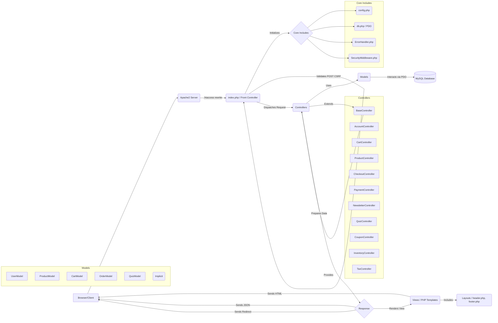

# The Scent – Technical Design Specification (v15.0)

## Table of Contents

1.  [Introduction](#introduction)
2.  [Project Philosophy & Goals](#project-philosophy--goals)
3.  [System Architecture Overview](#system-architecture-overview)
    *   3.1 [High-Level Workflow](#high-level-workflow)
    *   3.2 [Request-Response Life Cycle (Implemented Confirmation Flow)](#request-response-life-cycle-implemented-confirmation-flow)
4.  [Directory & File Structure](#directory--file-structure)
    *   4.1 [Folder Map](#folder-map)
    *   4.2 [Key Files Explained](#key-files-explained)
5.  [Routing and Application Flow](#routing-and-application-flow)
    *   5.1 [URL Routing via .htaccess](#url-routing-via-htaccess)
    *   5.2 [index.php: The Application Entry Point](#indexphp-the-application-entry-point)
    *   5.3 [Controller Dispatch & Action Flow](#controller-dispatch--action-flow)
    *   5.4 [Views: Templating and Rendering](#views-templating-and-rendering)
6.  [Frontend Architecture](#frontend-architecture)
    *   6.1 [CSS (css/style.css), Tailwind (CDN), and Other Libraries](#css-cssstylecss-tailwind-cdn-and-other-libraries)
    *   6.2 [Responsive Design and Accessibility](#responsive-design-and-accessibility)
    *   6.3 [JavaScript: Interactivity, Libraries, and CSRF Handling](#javascript-interactivity-libraries-and-csrf-handling)
7.  [Key Pages & Components](#key-pages--components)
    *   7.1 [Home/Landing Page (views/home.php)](#homelanding-page-viewshomephp)
    *   7.2 [Header and Navigation (views/layout/header.php)](#header-and-navigation-viewslayoutheaderphp)
    *   7.3 [Footer and Newsletter (views/layout/footer.php)](#footer-and-newsletter-viewslayoutfooterphp)
    *   7.4 [Product Grid & Cards](#product-grid--cards)
    *   7.5 [Shopping Cart (views/cart.php)](#shopping-cart-viewscartphp)
    *   7.6 [Product Detail Page (views/product_detail.php)](#product-detail-page-viewsproduct_detailphp)
    *   7.7 [Products Page (views/products.php)](#products-page-viewsproductsphp)
    *   7.8 [Checkout Process (views/checkout.php)](#checkout-process-viewscheckoutphp)
    *   7.9 [Order Confirmation (views/order_confirmation.php)](#order-confirmation-viewsorder_confirmationphp)
    *   7.10 [User Account Pages (views/account/*)](#user-account-pages-viewsaccount)
    *   7.11 [Quiz Flow & Personalization](#quiz-flow--personalization)
8.  [Backend Logic & Core PHP Components](#backend-logic--core-php-components)
    *   8.1 [Includes: Shared Logic (includes/)](#includes-shared-logic-includes)
    *   8.2 [Controllers: Business Logic Layer (controllers/ & BaseController.php)](#controllers-business-logic-layer-controllers--basecontrollerphp)
    *   8.3 [Database Abstraction (includes/db.php & models/)](#database-abstraction-includesdbphp--models)
    *   8.4 [Security Middleware & Error Handling](#security-middleware--error-handling)
    *   8.5 [Session, Auth, and User Flow](#session-auth-and-user-flow)
    *   8.6 [Payment Processing & Webhook Handling](#payment-processing--webhook-handling)
9.  [Database Design](#database-design)
    *   9.1 [Entity-Relationship Model (Conceptual)](#entity-relationship-model-conceptual)
    *   9.2 [Core Tables (from schema.sql + Updates)](#core-tables-from-schemasql--updates)
    *   9.3 [Schema Considerations & Recommendations](#schema-considerations--recommendations)
    *   9.4 [Data Flow Examples (Current State)](#data-flow-examples-current-state)
10. [Security Considerations & Best Practices](#security-considerations--best-practices)
    *   10.1 [Input Sanitization & Validation](#input-sanitization--validation)
    *   10.2 [Session Management](#session-management)
    *   10.3 [CSRF Protection (Implemented - Strict Pattern Required)](#csrf-protection-implemented---strict-pattern-required)
    *   10.4 [Security Headers & CSP Standardization](#security-headers--csp-standardization)
    *   10.5 [Rate Limiting (Applied to Key Endpoints)](#rate-limiting-applied-to-key-endpoints)
    *   10.6 [File Uploads & Permissions](#file-uploads--permissions)
    *   10.7 [Audit Logging & Error Handling](#audit-logging--error-handling)
    *   10.8 [SQL Injection Prevention](#sql-injection-prevention)
    *   10.9 [Payment Security](#payment-security)
11. [Extensibility & Onboarding](#extensibility--onboarding)
    *   11.1 [Adding Features, Pages, or Controllers](#adding-features-pages-or-controllers)
    *   11.2 [Adding Products, Categories, and Quiz Questions](#adding-products-categories-and-quiz-questions)
    *   11.3 [Developer Onboarding Checklist](#developer-onboarding-checklist)
    *   11.4 [Testing & Debugging Notes](#testing--debugging-notes)
12. [Future Enhancements & Recommendations](#future-enhancements--recommendations)
13. [Appendices](#appendices)
    *   A. [Key File Summaries](#a-key-file-summaries)
    *   B. [Glossary](#b-glossary)
    *   C. [Code Snippets and Patterns (CSRF, Implemented Confirmation Flow)](#c-code-snippets-and-patterns-csrf-implemented-confirmation-flow)
    *   D. [Mandatory Database Patch](#d-mandatory-database-patch)

---

## 1. Introduction

The Scent is a modular, secure, and extensible e-commerce platform focused on delivering premium aromatherapy products. It’s engineered with a custom PHP MVC-inspired architecture without reliance on heavy frameworks, maximizing transparency and developer control. This document (**v15.0**) serves as the updated technical design specification, reflecting the project's current state after applying significant fixes and standardizations.

This version documents **major improvements and stability fixes**:

1.  **Fixed Checkout Page Load:** Resolved fatal error preventing `views/checkout.php` loading. Requires DB patch application.
2.  **Fixed Order Confirmation Flow:** Replaced flawed session logic with robust Stripe API verification.
3.  **Fixed Account Pages UI:** Corrected broken layout by including standard headers/footers.
4.  **Fixed Quiz CSRF Error:** Resolved CSRF token issue preventing quiz submission.
5.  **Fixed Product Filter SQL Error:** Corrected query error when filtering products by category.
6.  **Fixed Quiz Redirect Error:** Removed overly strict URL validation preventing redirects after quiz submission.
7.  **Addressed Cart Storage Inconsistency:** `CartController` now strictly separates Session (Guest) vs. DB (Logged-in) storage. `$_SESSION['cart_count']` is now the reliable source for the header.
8.  **Addressed Inconsistent Rate Limiting:** Rate limiting is now applied to key sensitive endpoints (Login, Register, Password Reset, Profile Update, Coupon Apply, Checkout Submit) via `BaseController::validateRateLimit()`.

**Remaining Known Issues / Areas for Improvement:**

*   **Address Saving:** Logic to *save* user addresses during profile updates or checkout is not yet implemented. Checkout pre-filling depends on data existing in the DB.
*   **Error Handling:** The "Headers Already Sent" warning noted in `ErrorHandler.php` suggests potential issues if errors occur late in the request lifecycle.
*   **Content Security Policy (CSP):** Needs review/tightening for production.
*   **Rate Limiting Coverage:** While applied to key areas, a full review for other potentially sensitive endpoints is recommended.

This document provides a comprehensive overview of the current architecture, logic, and flow, serving as an onboarding guide and reference for ongoing development.

---

## 2. Project Philosophy & Goals

*   **Security First:** Implemented via PDO Prepared Statements, input validation (`SecurityMiddleware`), secure session handling, CSRF protection (Synchronizer Token Pattern, enforced globally on POST), security headers (CSP needs review), **rate limiting applied to key endpoints**.
*   **Simplicity & Maintainability:** Modular structure, clear includes in `index.php`. Consistent coding patterns enforced.
*   **Extensibility:** Architecture allows adding new features/pages. Clear extension points.
*   **Performance:** Direct routing, PDO prepared statements. CDN for frontend libs. APCu used for rate limiting.
*   **Modern User Experience:** Responsive design (Tailwind), subtle animations (AOS.js, Particles), AJAX interactions (Cart, Newsletter, Login/Register). **Core user flows functional and stable.**
*   **Transparency:** Explicit routing and includes in `index.php`.
*   **Accessibility & SEO:** Semantic HTML, `aria-label` usage. Basic practices followed.

---

## 3. System Architecture Overview

### 3.1 High-Level Workflow



*   **Key Principles:** Centralized routing (`index.php`), separation of concerns (Controller logic, Model data access, View presentation), secure database interaction (PDO Prepared Statements), global CSRF validation on POST. `BaseController` provides shared utilities. **Cart storage logic standardized in `CartController`.** **Rate limiting applied in relevant controllers.**

### 3.2 Request-Response Life Cycle (Implemented Confirmation Flow)

*(Example: User completes payment and is redirected back)*

1.  **Redirect from Stripe:** User lands on `index.php?page=checkout&action=confirmation&payment_intent=pi_...&payment_intent_client_secret=cs_...`
2.  **Initialization (`/index.php`):** Core files loaded, DB connected, security middleware applied. Session started.
3.  **Routing (`/index.php`):** `$page='checkout'`, `$action='confirmation'`. Routes to `CheckoutController::showOrderConfirmation()`.
4.  **Controller Action (`CheckoutController::showOrderConfirmation` - **Fixed & Robust Logic**):**
    *   `$this->requireLogin()`: Verifies user session.
    *   Extracts & validates `payment_intent` ID (`$paymentIntentId`) from `$_GET`.
    *   Retrieves `StripeClient` via `$this->paymentController->getStripeClient()`.
    *   **Calls Stripe API:** `$stripeClient->paymentIntents->retrieve($paymentIntentId)`.
    *   **Verifies PI Status:** Checks if status is `'succeeded'`. Redirects if not.
    *   **Fetches Order:** `$this->orderModel->getByPaymentIntentId($paymentIntentId)`.
    *   **Validates Order & Ownership:** Checks if order exists and belongs to logged-in user.
    *   **Fetches Full Order Details:** `$this->orderModel->getByIdAndUserId(...)`.
    *   **Renders View:** `$this->renderView('order_confirmation', ['order' => $fullOrder, ...])`.
5.  **View Rendering (`views/order_confirmation.php`):** Displays verified order details.
6.  **Response Transmission:** Server sends rendered HTML to browser.

---

## 4. Directory & File Structure

### 4.1 Folder Map

*(Structure remains the same as TDS v14.0)*

### 4.2 Key Files Explained

*(Updates based on latest fixes)*

| File/Folder                     | Purpose                                                        | Status Notes                                                                                  |
| :------------------------------ | :------------------------------------------------------------- | :-------------------------------------------------------------------------------------------- |
| `index.php`                     | Entry point, routing, core includes, auto POST CSRF validation | OK. Correct DI.                                                                               |
| `config.php`                    | DB credentials, App/Security settings, API keys              | OK. CSP/Rate Limit review needed. Secrets exposure.                                             |
| `includes/SecurityMiddleware.php`| Static security helpers (validation, CSRF)                   | OK.                                                                                           |
| `controllers/BaseController.php`| Abstract base helpers (DB, JSON, auth, CSRF, Rate Limit)     | OK. **`redirect` URL validation fixed.** Rate limiting logic OK.                                |
| `controllers/AccountController.php`| User auth/profile logic. AJAX/standard POST.                 | **Functional.** **Rate limiting applied to `updateProfile`.**                                   |
| `controllers/CheckoutController.php`| Handles checkout. AJAX interaction.                            | **Loads OK. Confirmation Flow Fixed.** **Rate limiting applied to `processCheckout`, `applyCouponAjax`.** |
| `controllers/PaymentController.php` | Stripe PI creation, Webhook handling                         | OK. Webhook session dependency removed. `getStripeClient()` available.                        |
| `controllers/CartController.php`    | Handles cart logic via AJAX.                                   | **Functional.** **Cart storage standardized (Session vs. DB).** Reliable session count update. |
| `controllers/ProductController.php`| Product listing/detail/admin.                                | OK. Pagination OK. **Filtering SQL error fixed.**                                           |
| `controllers/QuizController.php`    | Quiz logic.                                                  | OK. **CSRF token passing fixed.**                                                           |
| `controllers/NewsletterController.php`| Newsletter signup/unsubscribe.                             | OK. **Rate limiting applied to `subscribe`.**                                                 |
| `models/User.php`               | User DB logic (**PDO Prepared Statements**).                   | **Updated & Functional.** `getAddress` implemented. Requires schema patch.                    |
| `models/Order.php`              | Order DB logic (**PDO Prepared Statements**).                  | OK.                                                                                           |
| `models/Product.php`            | Product DB logic (**PDO Prepared Statements**).                | OK. **Filtering SQL error fixed.**                                                          |
| `models/Cart.php`               | DB cart logic (**PDO Prepared Statements**).                   | OK. Used only for logged-in users now.                                                        |
| `models/Quiz.php`               | Quiz DB logic (**PDO Prepared Statements**).                   | **Updated with missing methods.** OK.                                                         |
| `views/layout/header.php`       | Header, nav, assets, outputs global CSRF token.              | OK. **Simplified cart count logic.**                                                          |
| `views/account/*.php`           | Account views (Dashboard, Orders, Profile, etc.)               | **UI Fixed.** Compatible with CSS/JS. OK.                                                     |
| `views/layout/footer.php`       | Footer, JS init, global AJAX handlers read CSRF token.       | OK.                                                                                           |
| `views/checkout.php`            | Checkout form view.                                            | **Loads OK.** Uses `$userAddress`. **Defensive coding added.** AJAX/Stripe OK.                |
| `views/order_confirmation.php`  | Confirmation view.                                             | **Functional.** Controller logic fixed.                                                     |
| `views/quiz.php`                | Quiz form view.                                                | OK. Controller passes CSRF token.                                                             |
| `js/main.js`                    | Frontend logic, AJAX handlers, CSRF handling via hidden input. | OK. Correctly handles CSRF for AJAX.                                                          |
| `includes/ErrorHandler.php`     | Global error handling.                                         | OK. "Headers Already Sent" issue noted.                                                       |
| `db/*`                          | Schema files.                                                  | **Update script is mandatory.**                                                               |

---

## 5. Routing and Application Flow

*(No fundamental changes needed)*

### 5.1 URL Routing via .htaccess

*   Standard `mod_rewrite` rules route non-file/directory requests to `/index.php`. Verified functional.

### 5.2 index.php: The Application Entry Point

*   Single entry point. Initializes core systems. Determines `$page`, `$action`. **Validates CSRF globally for POST requests.** Dispatches based on `$page`.

### 5.3 Controller Dispatch & Action Flow

*   Controllers included/instantiated within `index.php`. Extend `BaseController`.
*   **CSRF Token Flow:** Controllers rendering views pass token (`$this->getCsrfToken()`). AJAX POST reads from `#csrf-token-value`. Standard POST uses hidden input `csrf_token`. Global validation in `index.php` handles this. **Correct.**
*   **Rate Limiting:** Checked via `$this->validateRateLimit('action_name')` at the start of relevant controller actions (Login, Register, Password Reset, Profile Update, Newsletter Subscribe, Coupon Apply, Checkout Submit). **Correctly applied.**

### 5.4 Views: Templating and Rendering

*   PHP files in `views/`. Use `htmlspecialchars()` for output.
*   **CSRF Token Output:** Global `#csrf-token-value` in `header.php`. Standard forms include `name="csrf_token"` input. **Correct.**

---

## 6. Frontend Architecture

*(No changes needed)*

### 6.1 CSS (css/style.css), Tailwind (CDN), and Other Libraries

*   Styling via Tailwind CDN + custom CSS.
*   Libraries: Google Fonts, Font Awesome 6, AOS.js, Particles.js (CDNs/local).

### 6.2 Responsive Design and Accessibility

*   Tailwind for responsiveness. Mobile menu functional. Basic accessibility considered.

### 6.3 JavaScript: Interactivity, Libraries, and CSRF Handling

*   `js/main.js`: Global UI, AJAX interactions. **Reads CSRF token correctly for AJAX POST.** Page initializers functional.

---

## 7. Key Pages & Components

*   **Home/Landing Page:** Functional.
*   **Header/Navigation:** Functional. CSRF output OK. **Cart count logic simplified and reliable.**
*   **Footer/Newsletter:** Functional.
*   **Product Grid/Cards:** Functional.
*   **Shopping Cart:** Functional with updated UI. AJAX OK. **Cart storage standardized.**
*   **Product Detail Page:** Functional.
*   **Products Page:** Functional. **Filters/Sorting/Pagination work correctly.**
*   **Checkout Process:** **Loads correctly.** Address pre-filling works. AJAX OK. Payment Intent OK.
*   **Order Confirmation:** **Functional & Reliable.** Logic fixed.
*   **User Account Pages:** **UI Fixed & Functional.**
*   **Quiz Flow:** **Functional.** CSRF issue fixed. **Redirect logic fixed.**

---

## 8. Backend Logic & Core PHP Components

*   **Includes:** Core utilities function as expected.
*   **Controllers:** Logic separated. `BaseController` provides shared functionality.
    *   `AccountController`: Functional. **Rate limiting applied.**
    *   `CheckoutController`: **Loads & Confirmation Flow Fixed.** **Rate limiting applied.**
    *   `PaymentController`: PI creation OK. Webhook confirmation OK.
    *   `CartController`: **Functional AJAX. Cart storage standardized.**
    *   `ProductController`: **Filtering SQL error fixed.** Admin routing OK.
    *   `QuizController`: **CSRF token passing fixed.**
    *   `NewsletterController`: **Rate limiting applied.**
    *   `BaseController`: Provides helpers. **Rate limiting logic OK.** **`redirect` fixed.**
*   **Database Abstraction:** PDO Prepared Statements used throughout Models. Secure.
*   **Models:**
    *   `User.php`: **Updated & Functional.** `getAddress` implemented. Requires patch.
    *   `Order.php`: Compatible. OK.
    *   `Product.php`: **Filtering SQL error fixed.** Pagination functional. OK.
    *   `Cart.php`: DB cart logic for logged-in users. OK.
    *   `Quiz.php`: Updated with missing methods. OK.
*   **Security Middleware & Error Handling:** Enforces headers, session rules, CSRF. Error handling global.
*   **Session, Auth, User Flow:** Secure session handling implemented. Auth flows functional.
*   **Payment Processing & Webhook:** Stripe PI flow implemented. Webhook confirmation OK.

---

## 9. Database Design

### 9.1 Entity-Relationship Model (Conceptual)

*(No changes needed)*

### 9.2 Core Tables (from schema.sql + Updates)

*   Schema defined in `the_scent_schema.sql.txt`.
*   **Mandatory Update:** `the_scent_update_users_table.sql` **must be applied** (See Appendix D).

### 9.3 Schema Considerations & Recommendations

*   **Addresses:** Currently in `users` table. Functional, but separate table recommended for scalability.
*   **Cart:** `cart_items` table used for logged-in users. Session used for guests. **This approach is now consistently implemented.**

### 9.4 Data Flow Examples (Current State)

*   **Add to Cart (Guest):** AJAX -> `CartController::addToCart` -> Updates `$_SESSION['cart']` & `$_SESSION['cart_count']` -> JSON response.
*   **Add to Cart (User):** AJAX -> `CartController::addToCart` -> `CartModel::addItem` (DB) -> Updates `$_SESSION['cart_count']` -> JSON response.
*   **Login:** AJAX -> `AccountController::login` -> Validates -> `CartController::mergeSessionCartOnLogin` (Session -> DB) -> Updates `$_SESSION['cart_count']` -> JSON response (redirect).
*   **Checkout Page Load:** Works. Fetches cart (DB/Session), user address, renders form.
*   **Checkout Submit:** Works. Server validates, creates order/PI, updates inventory, returns clientSecret.
*   **Payment Success -> Redirect:** Works. Stripe redirects to confirmation URL.
*   **Confirmation Page Load:** **Works.** `CheckoutController` uses `payment_intent` ID to verify via Stripe API, checks ownership, fetches order, renders view.
*   **Quiz Submit:** **Works.** `QuizController` validates CSRF, gets recommendations, saves result, redirects to results page.

---

## 10. Security Considerations & Best Practices

*   **Input Sanitization & Validation:** Implemented via `SecurityMiddleware`.
*   **Session Management:** Implemented (Secure flags, regeneration, integrity checks).
*   **CSRF Protection:** Implemented & Fixed (Synchronizer Token Pattern, global POST validation).
*   **Security Headers & CSP:** Implemented. CSP needs review/tightening.
*   **Rate Limiting:** **Applied to Key Endpoints.** Mechanism exists (`BaseController`), relies on APCu. Review coverage.
*   **File Uploads & Permissions:** Validation logic exists. Secure handling needed if used. `logs/` needs correct permissions.
*   **Audit Logging & Error Handling:** Implemented. Error handling has "Headers Already Sent" issue noted.
*   **SQL Injection Prevention:** Implemented via PDO Prepared Statements.
*   **Payment Security:** Offloaded to Stripe Elements. Webhook signature verification implemented.

---

## 11. Extensibility & Onboarding

### 11.1 Adding Features, Pages, or Controllers

*   Follow pattern: Controller -> View -> `index.php` route. Implement CSRF token pattern for POST. Extend `BaseController`. Apply rate limiting if needed.

### 11.2 Adding Products, Categories, and Quiz Questions

*   Via DB or future Admin UI.

### 11.3 Developer Onboarding Checklist

1.  Setup LAMP/LEMP, enable `mod_rewrite`.
2.  Clone repo.
3.  Setup DB, import *base* schema (`the_scent_schema.sql.txt`).
4.  **Apply DB schema updates:** Execute `the_scent_update_users_table.sql`. (**Mandatory**)
5.  Configure `config.php`.
6.  Set file permissions (`logs/` writable).
7.  Configure Apache VirtualHost.
8.  **(Optional but Recommended):** If using Composer, run `composer install`.
9.  Browse site, check logs (`error.log`, `security.log`).
10. **Verify CSRF flow** (inspect views/JS, test POST actions: Quiz, Login, Register, Newsletter, Cart, Profile Update).
11. **Verify Core Functionality:** Add-to-Cart (Guest & Logged-in), Cart View/Update, Product List/Pagination/Filtering, Login/Register, Profile Update, Password Reset, Quiz Flow. Verify Checkout page loads. **Verify successful payment leads to the Order Confirmation page.** **Verify Account Dashboard UI.**
12. **Verify Rate Limiting:** Trigger limits for actions like Login, Register, Password Reset Request.
13. **Note Remaining Known Issues:** Address Saving, "Headers Already Sent" error.

### 11.4 Testing & Debugging Notes

*   Use browser dev tools, application logs (`logs/`), server logs (`apache_logs/`).
*   Test Checkout page load.
*   Test User Profile/Password flows.
*   **Test the full payment flow through to the Order Confirmation page.**
*   **Test cart behavior when logging in/out (session merge).**
*   Test Quiz submission and results page redirect.
*   Test Product category filtering.
*   Test Account Dashboard UI.
*   Test rate limits.
*   Enable `ENVIRONMENT = 'development'` in `config.php` for detailed PHP errors during debugging.

---

## 12. Future Enhancements & Recommendations

*(Prioritized List - Critical issues addressed)*

1.  **Implement Address Saving (High Priority):** Add logic to save/update user addresses (profile/checkout). Update `views/checkout.php` to use this stored data.
2.  **Fix Error Handling ("Headers Already Sent") (Medium Priority):** Make `views/error.php` self-contained or use output buffering more consistently in `ErrorHandler` to prevent this warning.
3.  **Review & Tighten Content Security Policy (Medium Priority):** Update CSP in `config.php` based on actual needs. Avoid `'unsafe-inline'` if possible.
4.  **Review Rate Limiting Coverage (Low Priority):** Ensure `validateRateLimit` is applied to all necessary endpoints beyond the key ones now covered.
5.  **Code Quality & Refactoring (Ongoing/Future):**
    *   Implement Composer for autoloading and managing dependencies (PHPMailer, Stripe SDK).
    *   Refactor `index.php` routing to a dedicated Router class.
    *   Consider a simple templating engine (e.g., Twig, Plates).
    *   Use `.env` files for configuration/secrets.
    *   Implement database migrations.
    *   Add unit/integration tests.
6.  **Full Admin Panel (Future):** Develop CRUD interfaces for Products, Orders, Users, etc. Improve Quiz Analytics methods in `QuizModel`.
7.  **Advanced Features (Future):** Search improvements, user reviews, wishlists, etc.

---

## 13. Appendices

### A. Key File Summaries

*(Updated status)*

| File/Folder                     | Purpose                                                        | Status Notes                                                                                  |
| :------------------------------ | :------------------------------------------------------------- | :-------------------------------------------------------------------------------------------- |
| `index.php`                     | Entry point, routing, core includes, auto POST CSRF validation | OK. Correct DI.                                                                               |
| `config.php`                    | DB credentials, App/Security settings, API keys              | OK. CSP/Rate Limit review needed. Secrets exposure.                                             |
| `includes/SecurityMiddleware.php`| Static security helpers (validation, CSRF)                   | OK.                                                                                           |
| `controllers/BaseController.php`| Abstract base helpers (DB, JSON, auth, CSRF, Rate Limit)     | OK. **`redirect` fixed.** Rate limiting logic OK.                                             |
| `controllers/AccountController.php`| User auth/profile logic. AJAX/standard POST.                 | **Functional.** **Rate limiting applied.**                                                    |
| `controllers/CheckoutController.php`| Handles checkout. AJAX interaction.                            | **Loads OK. Confirmation Flow Fixed.** **Rate limiting applied.**                               |
| `controllers/PaymentController.php` | Stripe PI creation, Webhook handling                         | OK. Webhook session dependency removed. `getStripeClient()` available.                        |
| `controllers/CartController.php`    | Handles cart logic via AJAX.                                   | **Functional.** **Cart storage standardized.** Reliable session count update.                   |
| `controllers/ProductController.php`| Product listing/detail/admin.                                | OK. Pagination OK. **Filtering SQL fixed.**                                                 |
| `controllers/QuizController.php`    | Quiz logic.                                                  | OK. **CSRF fixed.**                                                                         |
| `controllers/NewsletterController.php`| Newsletter signup/unsubscribe.                             | OK. **Rate limiting applied.**                                                              |
| `models/User.php`               | User DB logic (**PDO Prepared Statements**).                   | **Updated & Functional.** `getAddress` implemented. Requires schema patch.                    |
| `models/Order.php`              | Order DB logic (**PDO Prepared Statements**).                  | OK.                                                                                           |
| `models/Product.php`            | Product DB logic (**PDO Prepared Statements**).                | OK. **Filtering SQL fixed.** Pagination functional. OK.                                     |
| `models/Cart.php`               | DB cart logic (**PDO Prepared Statements**).                   | OK. Used only for logged-in users now.                                                        |
| `models/Quiz.php`               | Quiz DB logic (**PDO Prepared Statements**).                   | **Updated.** OK.                                                                            |
| `views/layout/header.php`       | Header, nav, assets, outputs global CSRF token.              | OK. **Cart count logic simplified.**                                                          |
| `views/account/*.php`           | Account views (Dashboard, Orders, Profile, etc.)               | **UI Fixed.** Compatible with CSS/JS. OK.                                                     |
| `views/layout/footer.php`       | Footer, JS init, global AJAX handlers read CSRF token.       | OK.                                                                                           |
| `views/checkout.php`            | Checkout form view.                                            | **Loads OK.** Uses `$userAddress`. **Defensive coding added.** AJAX/Stripe OK.                |
| `views/order_confirmation.php`  | Confirmation view.                                             | **Functional.** Controller logic fixed.                                                     |
| `views/quiz.php`                | Quiz form view.                                                | OK. Controller passes CSRF token.                                                             |
| `js/main.js`                    | Frontend logic, AJAX handlers, CSRF handling via hidden input. | OK. Correctly handles CSRF for AJAX.                                                          |
| `includes/ErrorHandler.php`     | Global error handling.                                         | OK. "Headers Already Sent" issue noted.                                                       |
| `db/*`                          | Schema files.                                                  | **Update script is mandatory.**                                                               |

### B. Glossary

(Standard terms)

### C. Code Snippets and Patterns (CSRF, Implemented Confirmation Flow)

*(Snippets remain the same as TDS v14.0 - pattern is correct)*

### D. Mandatory Database Patch

The file `db/the_scent_update_users_table.sql` **must** be applied to your database after importing the base schema (`the_scent_schema.sql.txt`). This patch adds crucial columns to the `users` table required for password resets, user status, newsletter preferences, address storage, and timestamps. Failure to apply this patch will result in errors, particularly during user registration, profile updates, and checkout page loading.

```sql
-- Content of the_scent_update_users_table.sql (example)
ALTER TABLE `users`
    ADD COLUMN `status` enum('active','inactive','locked') NOT NULL DEFAULT 'active' COMMENT 'User account status (active, inactive, locked)' AFTER `role`,
    ADD COLUMN `newsletter_subscribed` tinyint(1) NOT NULL DEFAULT '0' COMMENT 'Flag indicating newsletter subscription (0=No, 1=Yes)' AFTER `status`,
    ADD COLUMN `reset_token` varchar(255) DEFAULT NULL COMMENT 'Secure token for password reset requests' AFTER `newsletter_subscribed`,
    ADD COLUMN `reset_token_expires_at` datetime DEFAULT NULL COMMENT 'Expiry timestamp for the password reset token' AFTER `reset_token`,
    ADD COLUMN `address_line1` varchar(255) DEFAULT NULL COMMENT 'Primary address line' AFTER `reset_token_expires_at`,
    ADD COLUMN `address_line2` varchar(255) DEFAULT NULL COMMENT 'Secondary address line (optional)' AFTER `address_line1`,
    ADD COLUMN `city` varchar(100) DEFAULT NULL COMMENT 'City name' AFTER `address_line2`,
    ADD COLUMN `state` varchar(100) DEFAULT NULL COMMENT 'State / Province / Region' AFTER `city`,
    ADD COLUMN `postal_code` varchar(20) DEFAULT NULL COMMENT 'Postal or ZIP code' AFTER `state`,
    ADD COLUMN `country` varchar(50) DEFAULT NULL COMMENT 'Country name or code' AFTER `postal_code`,
    ADD COLUMN `updated_at` timestamp NULL DEFAULT CURRENT_TIMESTAMP ON UPDATE CURRENT_TIMESTAMP COMMENT 'Timestamp of the last record update' AFTER `created_at`,
    ADD INDEX `idx_reset_token` (`reset_token`),
    ADD INDEX `idx_status` (`status`);

-- It's crucial to ensure the 'created_at' column also exists and is properly defined,
-- potentially with a default CURRENT_TIMESTAMP if not already set.
-- ALTER TABLE `users` MODIFY COLUMN `created_at` timestamp NULL DEFAULT CURRENT_TIMESTAMP;
```

---
https://drive.google.com/file/d/15n5Z5mfWZR34xCedeNAAM6yIfm1-FWHU/view?usp=sharing, https://drive.google.com/file/d/16GeRFaJufIhZkc6PiZEGOXcdsOd7tBHu/view?usp=sharing, https://drive.google.com/file/d/1AfNx4eK9bILxDYig8-ns-QefvSvL-Pea/view?usp=sharing, https://drive.google.com/file/d/1BKHUJxNXkL0LaOqLYe_1iR9Pm0WcECAh/view?usp=sharing, https://aistudio.google.com/app/prompts?state=%7B%22ids%22:%5B%221CERPFoP63KbINXZ9VdrkC3jYm7dwmQXO%22%5D,%22action%22:%22open%22,%22userId%22:%22103961307342447084491%22,%22resourceKeys%22:%7B%7D%7D&usp=sharing, https://drive.google.com/file/d/1Ii_et2GgZUMfA_HH1SZlP3hpxiVZap_w/view?usp=sharing, https://drive.google.com/file/d/1TP6uFvb5Z87SPbtrPU8C47ajbkz8IpDU/view?usp=sharing, https://drive.google.com/file/d/1TSiGE6QNnLaJaDR5GQ908SvOzPBx-QfB/view?usp=sharing, https://drive.google.com/file/d/1V5nBvD9m0BQtwPJMbM935eBHtzgq2q5x/view?usp=sharing, https://drive.google.com/file/d/1WQ0bQETlO_rxE59s7byblCDqhTEMu9MX/view?usp=sharing, https://drive.google.com/file/d/1YcBsA8LnyLr4A3LtI1MXKK1L5atjvaGs/view?usp=sharing, https://drive.google.com/file/d/1eT100kdTNr0wJTTQzw7e23BQoxUpDkXf/view?usp=sharing, https://drive.google.com/file/d/1kglCS-e_-vgfchd4cVZXgvHSPagKFcbT/view?usp=sharing, https://drive.google.com/file/d/1m7MjeSIYuSj0Tl4pOdV798bhZQIXSIRc/view?usp=sharing, https://drive.google.com/file/d/1vfgp4mJYTE_XUleYpOQpbzR_ioYZ9LdF/view?usp=sharing, https://drive.google.com/file/d/1zHS8LxhZDjUpgksZsQDaDi0lIXo-VuJa/view?usp=sharing
